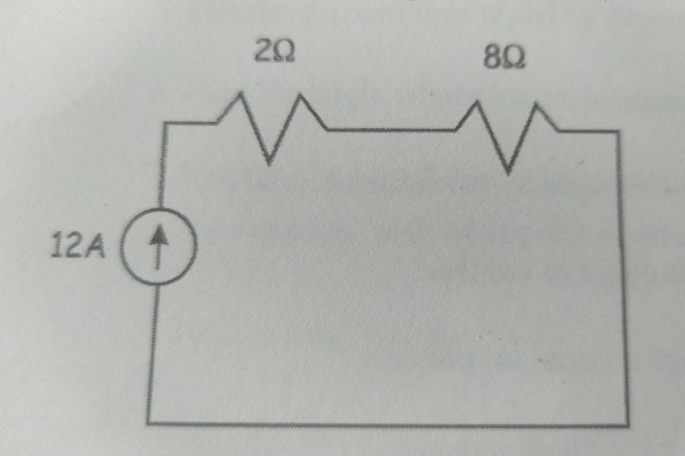

# Analisis del problema

## Problema a resolver
Diseñar un porgrama que calcula y muestre el voltaje a traves de las dos resistencias

## Información que conozco
* Valor de i = 12
* Valor de R1 = 2
* Valor de R2 = 8

## Qué puedo visualizar
### Ecuación de voltaje 
v = i * R
### Ecuacion de resistencia en serie
R = R1+ R2 + Rn
### Imagen del circuito

## Información del usuario
* Valor de i. 
* Valor de resistencia 1.
* Valor de resistencia 2.

## Que información debo devolver
* El voltaje que pasa por las 2 resistencias

