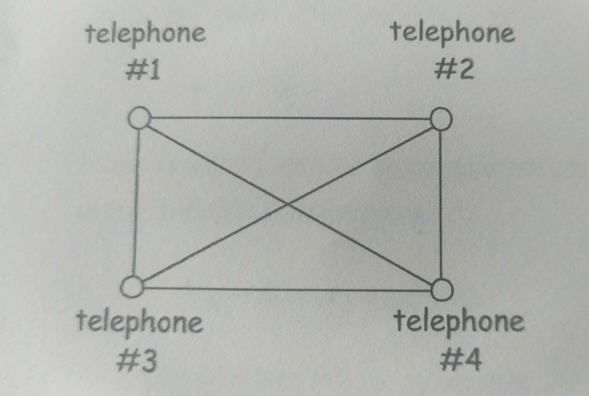

# Analisis del problema

## Problema a resolver
Diseñar un porgrama que calcule y muestre el número de linea requerido para conectar n teléfonos. 

## Información que conozco
* El valor n debe ser dado por el usuario. 
* La ecuación del número de líneas

## Qué puedo visualizar
### Ecuación del número de líneas
lines = n(n-1) /2

### Imagen del las líneas telefónicas

## Información del usuario
* Valor de n

## Que información debo devolver
* El número de líneas necesarias para conectar los n teléfonos.

