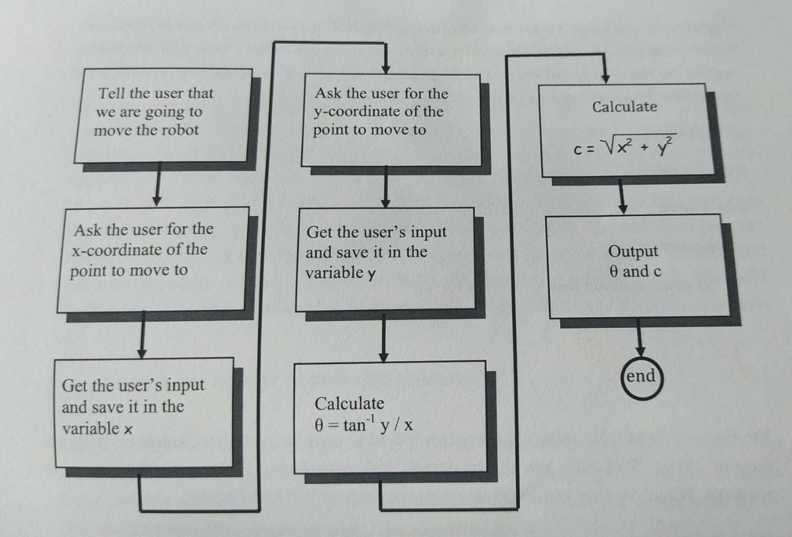

ME TOCA LA PAGINA 42
###
# Fundamentals Of Programming
# Capítulo 1. Introduction to Programming 

## File Prologue
Todos los programas que codifiques, deberían tener un file prologue. La estructura es la siguiente: 
```C#
//Program 1
//CS 1400 Sectio 001
//Instructor: Prof debr
//Contents: source code for example 1
//Date last modified: 08/28/2021
//Version 1.0
//Author: Carlos Che

```

## Código 
### Main Method 
Es el método principal del programa, todos los programas deben tenerlo, y tiene las declaraciones de que es lo que se desea que el programa haga.  Estructura:  
``` c#
static void Main(){

}
```

### Comentarios
Existen dos tipos de comentarios, los de una línea que ignoran todo lo que este escrito hasta encontrar un salto de línea, y los multilineas que ignoran todo lo escrito en las lineas comentadas. Estructura de ambos:

```c#
//COMENTARIO DE UNA LINEA

/* ESTE 
ES UN 
COMENTARIO 
MULTILINEA 
...
*/

```
## Términos
* <b>namespace </b> es similar a un folder. Por ejemplo si tenemos un folder de ciencias con un archivo llamado clase 1 y otro folder de matemáticas con otro archivo llamado clase 1, el archivo clase 1 no se confunde ya que estan en folders distintos. 
Es igual para los namespace, al escribir código debemos especificar que namespace se esta utilizando para que el programa no confunda los nombre de otros archivos.

* <b>Clase </b> Todos los programas de C# deben tener al menos una clase, estas siempre incian con el nombre clase y luego "{" "}" donde dentro de las llaves va todo el código del programa a escribir. 

* <b> Variables locales y globales </b> Las variables locales son las que estan dentro de un método y solo pueden ser accedidas dentro de ese método. Las globales se encuentran fuera del main y pueden ser accedidas desde cualquier parte.

* <b>Statements </b> Son lineas de instrucciones, usualmente terminan con ";" 


## Conocimientos Generales
* Un algoritmo es una descripción paso a paso de cómo resolver un problema
* Un compilador es un programa que convierte tu código en un lenguaje de programación a código máquina que tu computadora entiende.
* UML or Unified Modeling Language es usado por los programadores para crear un modelo visual del problema a resolver.
* Un IDE es una herramienta de desarrollo de software que tiene todo en un solo paquete. Tiene un editor de código, un compilador, herramientas para hace debbug, y más.
* La memoria de la computadora está dividida en 4 segmentos: segmento de código, segmento de datos, heap, stack.

# Capítulo 2. Program Desing
Por lo general, las personas nuevas en la programación, siempre tienden a que cuando tienen que realizar un programa, van directo al código y no debería ser así.

Un buen programador se toma el tiempo necesario para averiguar a que se quiere llegar y pensar como resolver el problema, esto hace que se ahorre mucho tiempo y esfuerzo.

## Creando un algoritmo
Un algoritmo es una solución paso a paso de un problema. 

Como empezar:

* Definir que es lo que se quiere lograr
* Determinar los datos de entrada necesarios. Estos pueden venir de:
    
    * Escritos por el usuario
    * De archivos 
    * De base de datos
    * Entre otros

* Determinar cuales son las salidas necesarias del programa
* Hacer una lista paso a paso de como transformar las entradas en salidas, detallando todos los procesos necesarios para lograr esto. 

Es importante también crear al menos un caso de prueba, donde se sigan los pasos uno a uno, y se hagan los calculos por tu cuenta, esto para asi comprobar que el algoritmo funciona bien.

## Diagrama de flujo
Es una representación gráfica de un algoritmo.
Cada actividad o paso esta representada por un rectangulo. Dentro del rectangulo se pone una descripción breve del algoritmo. Ejemplo:



Con el diagrama de flujo y el algoritmo creado, el siguiente paso es programar la solución.

## Crear un algoritmo Worksheet
1.  Definir cual es el problema a resolver.
2.  Definir que información conozco
3.  Definir que puedo visulizar del problema. Imagenes, diagramas, gráficos, patrones, relaciones, ecuacioens, etc.
4. Definir que información necesito del usuario
5. Definir que información debe devolver mi algoritmo
6. Escribir paso a paso que se hara, se puede hacer en pseudocode
7. Crear valores de prueba y verificar a mano que resultados debe devolver el programa con esos valores.


